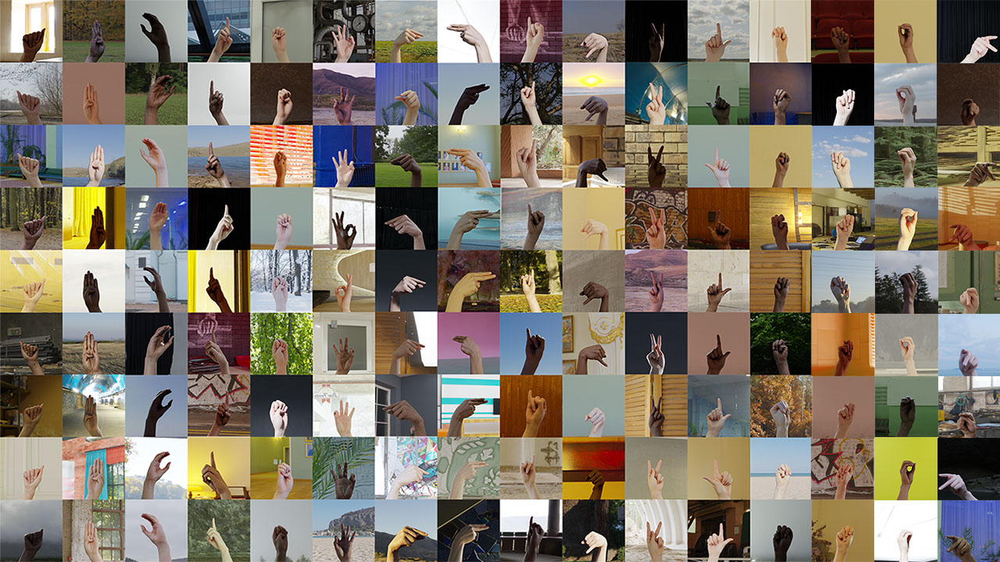

# ASL Alphabet Recognition with PyTorch
<a href="#"></a>
<a href="https://pytorch.org/"></a>

## Trained on Synthetic ASL Alphabet
[](https://www.kaggle.com/datasets/lexset/synthetic-asl-alphabet)


## Quick start

1. [Install CUDA](https://developer.nvidia.com/cuda-downloads)

2. [Install PyTorch 2.91 or later](https://pytorch.org/get-started/locally/)

3. Install dependencies
```bash
pip install -r requirements.txt
```

4. [Download the data](https://www.kaggle.com/datasets/lexset/synthetic-asl-alphabet)

5. Run training:
```bash
python train.py
```


## Usage

### Training

```console
> python train.py -h
usage: train.py [-h] [--epochs e] [--batch-size b] [--learning-rate lr]

optional arguments:
  -h, --help            show this help message and exit
  --epochs, -e          Number of epochs
  --batch-size, -b      Batch size
  --learning-rate, -lr  Learning rate
  --seed                Random seed
  --num_workers         Number of data loading workers
```


### Prediction

After training your model and saving it to `MODEL.pth`, you can easily test the output on your images via the [Gradio](https://www.gradio.app/).


```bash
python predict.py
```